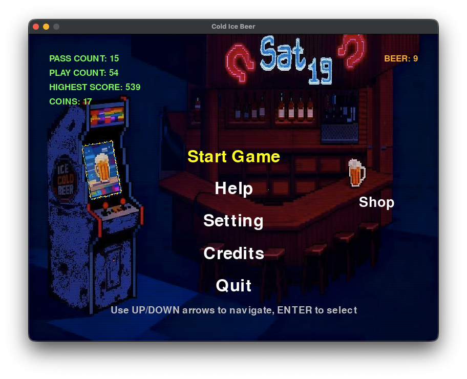
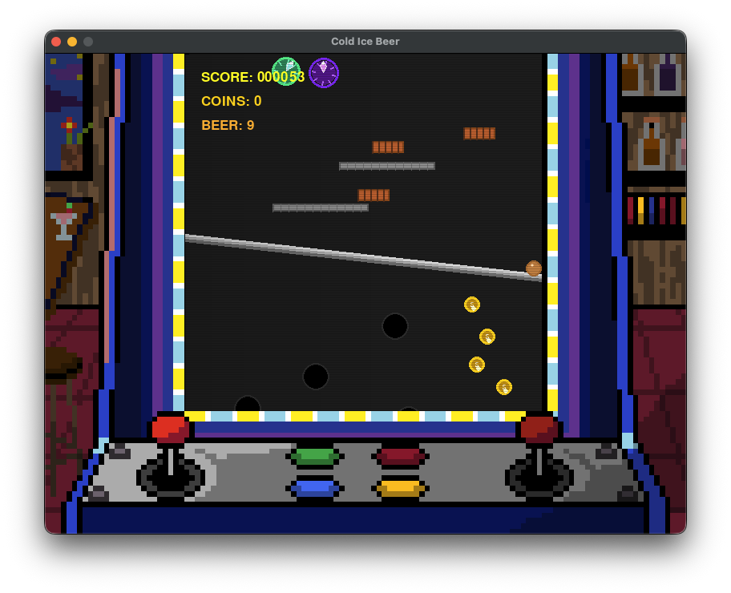

# Ice Cold Beer 🍺
*One Legend. Three Trials. Infinite Glory.*

A challenging arcade-style game created in 24 hours for the University of Bristol CSS Game Jam.

## About 🎮

Guide your ball through treacherous obstacles to reach the legendary "Glacier's Heart" beer in this retro-styled arcade challenge. Built with Python and Pygame.

## Team Members 👥

### Saturday 1️⃣9️⃣

- Stephen Y
- Psyche S
- Kehao Z
- Siyue T
- Xiaoting H
- Quincy L

## Controls 🕹️

- **Left Side**: W = Up, S = Down
- **Right Side**: ↑ = Up, ↓ = Down
- **ESC**: Pause/Return to menu

## Run the Game 🎰

```bash
python main.py
```
## Welcome to Sat 19, Ladies and Gentlemen !!!



